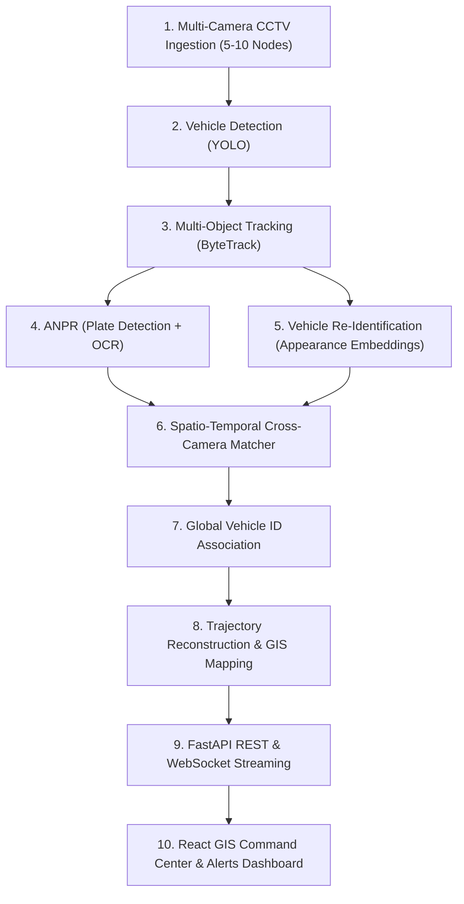

# CITYVISION AI — System Architecture Document

**Problem Statement**: SIH26127 — City-Wide AI Engine for Multi-Camera ANPR Trajectory Tracking and Urban Traffic Analytics  
**Document Version**: 0.1.0 (Initial Architectural Baseline)

---

## 1. High-Level Pipeline Architecture

The end-to-end multi-camera traffic tracking pipeline follows a strictly sequential, modular data flow:

---

## 2. Component Specifications

### 2.1 Video Ingestion & Stream Management (`backend/app/services/video_ingestion.py`)
- Manages synchronized or asynchronous video streams from 5–10 virtual CCTV nodes.
- Each camera node is indexed by geographical coordinates (`latitude`, `longitude`), compass heading (`heading_deg`), and frame rate.
- Supports loopback playback on recorded files for deterministic testing and live RTSP streams for deployment.

### 2.2 Vehicle Detection (`ai/detectors/`)
- Abstract contract: `BaseVehicleDetector`.
- Implementation targets: YOLOv8 / YOLO11 CPU/CUDA inference.
- Targets 4 primary vehicle classes: `car`, `motorcycle`, `bus`, `truck`.

### 2.3 Multi-Object Tracking (`ai/trackers/`)
- Abstract contract: `BaseTracker`.
- Implementation target: ByteTrack algorithm utilizing Kalman filtering and Hungarian association to maintain stable single-camera tracks (`track_id`).

### 2.4 Automatic Number Plate Recognition (`ai/anpr/`)
- Two-stage architecture:
  1. `BasePlateDetector`: Localizes rectangular plate region on vehicle crop.
  2. `BasePlateOCR`: Optical character recognition extracting alphanumeric plate string with character confidence scores.

### 2.5 Vehicle Re-Identification (`ai/reid/`)
- Abstract contract: `BaseVehicleReID`.
- Extracts 512-dimensional deep appearance embeddings (trained on VeRi-776 / VehicleID) invariant to viewpoint, lighting, and camera color temperature.

### 2.6 Cross-Camera Association & Global ID (`ai/matching/`)
- Abstract contract: `BaseCrossCameraMatcher`.
- Fuses:
  - Exact or fuzzy plate string matches.
  - Cosine similarity of Re-ID visual embeddings.
  - Spatio-temporal road graph feasibility constraints (physical travel time and maximum road speed limits between non-overlapping cameras).
- Assigns persistent `GlobalVehicleID` across the city.

### 2.7 Storage & Telemetry Backend (`backend/`)
- Built on FastAPI with asynchronous routing.
- Provides REST endpoints for historical trajectories, watchlist management, and city-wide traffic volume analytics.
- Real-time WebSocket channel (`/ws/telemetry`) pushing live tracklets and alerts.

### 2.8 Frontend GIS Command Center (`frontend/`)
- React + TypeScript dashboard.
- Features:
  - Multi-Camera Grid (live stream playback).
  - City GIS Map (camera markers & trajectory path lines).
  - Global Vehicle Search (ANPR plate lookup).
  - Vehicle Dossier Modal (traveled route, timestamps, speed estimates).
  - Real-Time Alerts Drawer (watchlist hits, traffic incidents).
  - Traffic Analytics Panels (hourly density, volume distribution).
